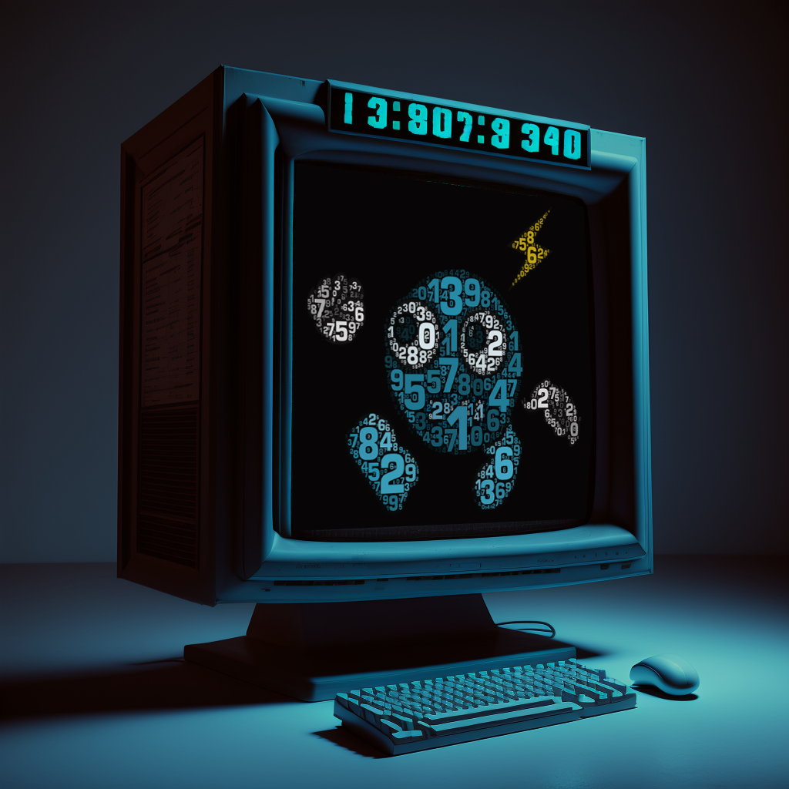

# JYNE
### Just Your Neighbourhood Executable

A versatile Discord bot built with Discord.js that offers a wide range of features including music playback, currency system, games, moderation tools, and AI-powered conversations. JYNE was designed to be your all-in-one Discord companion.

## ✨ Features

🎵 Music System

- Play music from YouTube and other sources
- Queue management with skip, pause, and resume functionality
- Real-time notifications for track changes
- Automatic disconnection when voice channel is empty

💰 Currency System

- Virtual currency called "Elysium"
- Daily and weekly rewards for active users
- Balance checking and transfer between users
- Currency integration with games and activities

🎮 Games & Entertainment

- Blackjack with betting system
- Hangman with various categories
- Guess the Number (GTN) with difficulty levels
- 8-ball fortune telling
- Coin flip and other mini-games
- Leaderboards to track high scores

🤖 AI Integration

- GPT-3.5 Turbo powered conversations
- Thread-based chat system for extended interactions
- Text summarization using NLP techniques
- Personalized AI responses based on user settings
- Image generation using Stable Diffusion

🔍 Search & Information

- Web search functionality
- YouTube video search
- Image search capabilities
- Cryptocurrency market information
- Chess.com player statistics

👮 Moderation Tools

- User management
- Strike system for rule violations
- Server configuration options
- Customizable user settings

## 🛠️ Tech Stack

- **Core**: Discord.js v14, Node.js
- **Database**: MongoDB with Mongoose
- **AI Integration**: OpenAI API (GPT-3.5 Turbo), Stable Diffusion (A1111)
- **Music Playback**: discord-player, @discordjs/voice
- **External APIs**: Twitter API, Chess.com API, CoinMarketCap, Google Translate
- **NLP & ML**: Python with NLTK, NetworkX for text summarization

## 🚀 Key Commands

### Music
- `/music play` - Play a song from YouTube
- `/music skip` - Skip the current song
- `/music queue` - View the current queue
- `/music stop` - Stop playback and clear the queue

### Currency
- `/daily` - Claim your daily Elysium reward
- `/weekly` - Claim your weekly Elysium reward
- `/balance` - Check your Elysium balance
- `/pay` - Transfer Elysium to another user

### Games
- `/blackjack` - Play blackjack with betting
- `/hangman` - Play a game of hangman
- `/gtn` - Play Guess the Number with various difficulties
- `/8ball` - Ask the magic 8-ball a question
- `/coinflip` - Flip a coin

### AI & Search
- `/chat` - Start a conversation with JYNE powered by GPT-3.5
- `/dream` - Generate images using Stable Diffusion
- `/search web` - Search the web for information
- `/search youtube` - Search for YouTube videos
- `/search images` - Search for images

## 💻 Machine Learning Features

JYNE includes a text summarization system built with Python and NLTK. The summarizer uses:

- Natural Language Processing techniques
- Cosine similarity to measure sentence relationships
- PageRank algorithm to identify key sentences
- Vector space models for text representation

The summarizer can condense large texts into concise summaries while preserving the most important information.

### Image Generation with `/dream`

JYNE features a powerful AI image generation system powered by Stable Diffusion running locally:

- **Multiple Models**: Choose from different Stable Diffusion models:
  - Main (SD v1.5 Enhanced with mdjrny-v4 style)
  - Realistic Vision (optimized for people and animals)
  - Fantasy/RPG (DreamShaper model for fantasy scenes)
  - Classic SD v1.5

- **Customization Options**:
  - Aspect ratio selection (1:1, 2:3, 3:2)
  - Custom negative prompts for better results
  - Sampler selection (DPM Solver, DPM++ 2M, LMS, Euler Ancestral)
  - Face correction for better human faces
  - Upscaling options (Regular or Anime-optimized)
  - Custom seed values for reproducible results
  - Adjustable inference steps (20-30 recommended)

- **Real-time Progress Updates**:
  - Live percentage updates during generation
  - Custom loading animations
  - Color-coded status indicators

- **Content Safety**:
  - Built-in content filtering system
  - Strike system for inappropriate prompt attempts
  - Automatic prompt analysis for prohibited content

- **Gallery System**:
  - All generated images saved to user profiles
  - Browse through previous creations
  - View detailed metadata (prompt, seed, date, model used)

The system connects to a locally hosted Stable Diffusion API (running on port 9090) and saves generated images to the bot's file system, with references stored in MongoDB.

## 🗃️ Database Structure

JYNE uses MongoDB to store user data, including:

- User profiles with currency balances
- Game statistics and high scores
- Achievement tracking
- User preferences and settings
- Command usage history
- Guild-specific configurations
- AI-generated image metadata and references

## 🔄 Development Timeline

- **2022**: Initial development and core features
- **2023**: Advanced features, AI integration, and refinements
- The bot was built using an older version of Discord.js and may require updates to work with the current Discord API

## 🙏 Acknowledgments

- [Discord.js](https://discord.js.org/) for the Discord API wrapper
- [OpenAI](https://openai.com/) for the GPT-3.5 Turbo API
- [Stable Diffusion](https://stability.ai/stable-diffusion) for image generation capabilities
- [AUTOMATIC1111](https://github.com/AUTOMATIC1111/stable-diffusion-webui) for the Stable Diffusion WebUI
- [MongoDB](https://www.mongodb.com/) for the database
- [NLTK](https://www.nltk.org/) for natural language processing capabilities

---

*Note: This bot was developed as a personal project and is no longer actively maintained. The code is provided as-is for educational purposes.*

